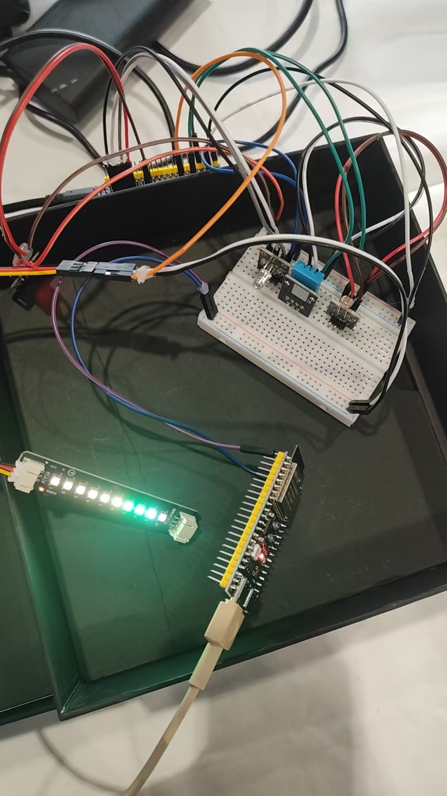
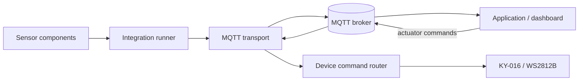

# Sleep Environment Detect

[English](README.md) | [简体中文](README.zh-CN.md)

An ESP-IDF 5.5.x C++ firmware reference for an ESP32-S3 sleep-environment prototype. The project brings environmental sensing, consumer-grade optical vital estimation, ambient feedback lighting, and an optional MQTT application boundary into one modular codebase.

> **Prototype notice:** This is a hardware bring-up and integration project. MAX30102 heart-rate and SpO2 values are consumer-grade estimates only. They are not calibrated, validated, or intended for medical use.



## What it does

| Area | Current capability |
| --- | --- |
| Environment | DHT11 temperature and relative humidity; KY-018 raw light ADC sampling |
| Optical sensing | MAX30102 I2C identification, FIFO capture, contact detection, and experimental heart-rate/SpO2 estimates |
| Ambient feedback | KY-016 RGB LED and a 10-pixel WS2812B strip |
| Local control | One serial console dispatcher for RGB and strip commands |
| Application interface | Optional Wi-Fi Station + MQTT telemetry, commands, acknowledgements, and LWT status |
| Isolation | Single-module profiles for hardware bring-up and fault isolation |

## Architecture



The firmware keeps hardware access in reusable ESP-IDF components. `main/` selects an active profile and schedules work; `device_app` owns actuator command routing; `network_manager` and `mqtt_transport` remain optional and load only when local credentials are supplied.

## Quick start

### Prerequisites

- ESP-IDF `v5.5.x`
- ESP32-S3 development board, verified against its silkscreen and schematic
- Power-safe wiring documented in [Hardware Guide](docs/HARDWARE.md)

### Build

```powershell
idf.py set-target esp32s3
idf.py build
```

The default `Integrated` profile initializes DHT11, KY-018, MAX30102, KY-016, and WS2812B. To isolate a module, set `envcfg::ACTIVE_TEST` in `include/app_config.h`, then rebuild.

### Optional MQTT provisioning

```powershell
Copy-Item main\secrets.h.example main\secrets.h
```

Edit only the ignored `main/secrets.h` with your own Wi-Fi and broker settings. Use TLS, per-device credentials, and broker ACLs in real deployments. See the [MQTT Contract](docs/MQTT_CONTRACT.md).

## Control contract

| Target | Topic suffix | Accepted payloads | Behaviour |
| --- | --- | --- | --- |
| KY-016 RGB LED | `actuator/rgb/set` | `0`, `1`, `2`, `3` | Off, red, green, blue |
| WS2812B strip | `actuator/led/set` | `0`, `7`, `8`, `9` | Off, warm breath, cool-blue breath, rainbow marquee |

Payload `0` is intentionally global off: a command sent to either actuator topic attempts to switch off both lighting devices. Every accepted or rejected MQTT command emits an acknowledgement on the matching `.../state` topic.

## Repository layout

```text
components/       Hardware drivers, command router, networking, MQTT
include/          Board-level GPIO and profile configuration
main/             Application entry point and scheduling
docs/             Bilingual hardware, architecture, MQTT, and security guides
web/              Credential-free MQTT WebSocket control page
assets/           Reviewed project media
```

## Documentation

- [Hardware guide](docs/HARDWARE.md) / [硬件接线](docs/HARDWARE.zh-CN.md)
- [Architecture](docs/ARCHITECTURE.md) / [系统架构](docs/ARCHITECTURE.zh-CN.md)
- [MQTT contract](docs/MQTT_CONTRACT.md) / [MQTT 协议](docs/MQTT_CONTRACT.zh-CN.md)
- [Security policy](docs/SECURITY.md) / [安全说明](docs/SECURITY.zh-CN.md)

## Security and privacy

This public snapshot deliberately excludes real network values, accounts, credentials, certificates, private keys, device logs, generated builds, and previous private Git history. Do not add them back. Report potential exposure through GitHub private security reporting rather than an issue.

## License

This project is released under the [MIT License](LICENSE). External ESP-IDF managed components remain governed by their respective licenses and are resolved from `main/idf_component.yml`.
