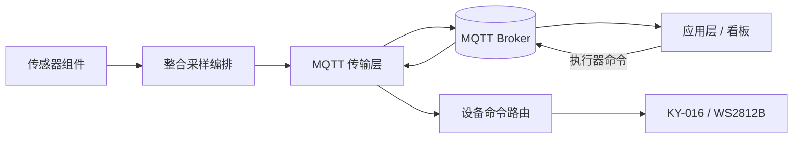

# 睡眠环境感知

[English](README.md) | [简体中文](README.zh-CN.md)

这是一个基于 ESP32-S3、ESP-IDF 5.5.x 与 C++ 的睡眠环境感知原型参考工程。它将环境传感、消费级光学体征估算、氛围灯反馈和可选 MQTT 应用层接口组织为独立组件，便于逐模块调试和后续整合。

> **原型声明：** MAX30102 的心率和血氧结果仅用于消费级信号探索。它们尚未校准或临床验证，不能用于医疗判断。


## 当前能力

| 方向 | 已实现能力 |
| --- | --- |
| 环境感知 | DHT11 温度/相对湿度；KY-018 光敏 ADC 原始采样 |
| 光学传感 | MAX30102 I2C 识别、FIFO 采集、接触判断与实验性心率/血氧估算 |
| 氛围反馈 | KY-016 三色 LED 与 10 颗 WS2812B 灯带 |
| 本地控制 | 一个统一的串口命令分发器控制两类灯 |
| 应用接口 | 可选 Wi-Fi Station、MQTT 遥测、控制命令、回执和 LWT 在线状态 |
| 故障隔离 | 每个模块都有独立测试模式，适合硬件 bring-up |

## 架构



硬件访问被封装在 ESP-IDF 组件中。`main/` 仅负责选择测试配置和调度；`device_app` 负责执行器命令路由；`network_manager` 和 `mqtt_transport` 是可选能力，只有本地提供凭据时才会启动。

## 快速开始

### 前置条件

- ESP-IDF `v5.5.x`
- ESP32-S3 开发板，必须依据板卡丝印与原理图核对引脚
- 按 [硬件接线说明](docs/HARDWARE.zh-CN.md) 完成安全接线

### 构建

```powershell
idf.py set-target esp32s3
idf.py build
```

默认 `Integrated` 配置会初始化 DHT11、KY-018、MAX30102、KY-016 和 WS2812B。排查单模块时，在 `include/app_config.h` 修改 `envcfg::ACTIVE_TEST` 后重新构建。

### 可选 MQTT 配置

```powershell
Copy-Item main\secrets.h.example main\secrets.h
```

只在被忽略的 `main/secrets.h` 中填写自己的 Wi-Fi 和 MQTT Broker 参数。正式部署应使用 TLS、每设备账号和 Broker ACL。协议见 [MQTT 应用层契约](docs/MQTT_CONTRACT.zh-CN.md)。

## 控制命令

| 设备 | 主题后缀 | 可接受负载 | 效果 |
| --- | --- | --- | --- |
| KY-016 三色 LED | `actuator/rgb/set` | `0`、`1`、`2`、`3` | 熄灭、红、绿、蓝 |
| WS2812B 灯带 | `actuator/led/set` | `0`、`7`、`8`、`9` | 熄灭、暖色呼吸、冷蓝呼吸、多彩跑马 |

`0` 是统一熄灭命令：无论发布到哪个执行器主题，固件都会尝试关闭两类灯。每条 MQTT 控制命令都会在对应的 `.../state` 主题返回成功或拒绝回执。

## 仓库结构

```text
components/       硬件驱动、命令路由、网络和 MQTT
include/          GPIO、总线和测试配置
main/             应用入口和调度
docs/             中英文硬件、架构、MQTT 和安全文档
web/              不含真实凭据的 MQTT WebSocket 控制页
assets/           已审核的项目图片资料
```

## 文档入口

- [Hardware guide](docs/HARDWARE.md) / [硬件接线](docs/HARDWARE.zh-CN.md)
- [Architecture](docs/ARCHITECTURE.md) / [系统架构](docs/ARCHITECTURE.zh-CN.md)
- [MQTT contract](docs/MQTT_CONTRACT.md) / [MQTT 协议](docs/MQTT_CONTRACT.zh-CN.md)
- [Security policy](docs/SECURITY.md) / [安全说明](docs/SECURITY.zh-CN.md)

## 安全与隐私

这个公开快照已排除真实网络地址、账号、密码、证书、私钥、设备日志、构建产物和历史私有 Git 提交。请不要重新提交这些内容。若发现疑似泄露，请使用 GitHub 私密安全报告，不要在 Issue 中公开。

## 许可证

项目采用 [MIT License](LICENSE)。ESP-IDF 组件管理器依赖仍遵循各自许可证，并由 `main/idf_component.yml` 解析。
